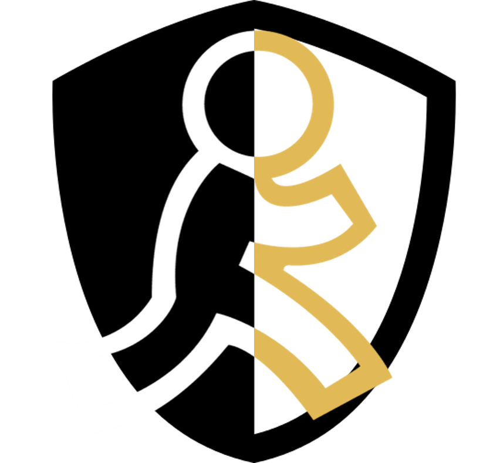
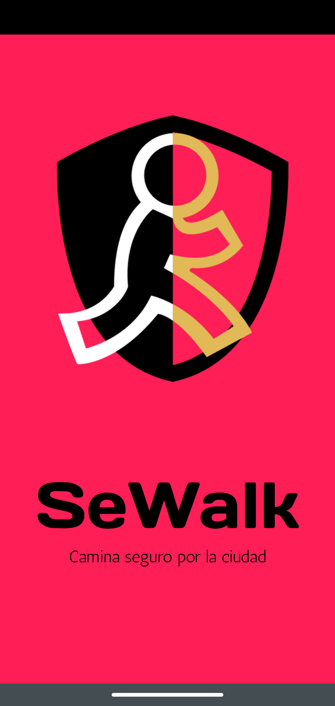
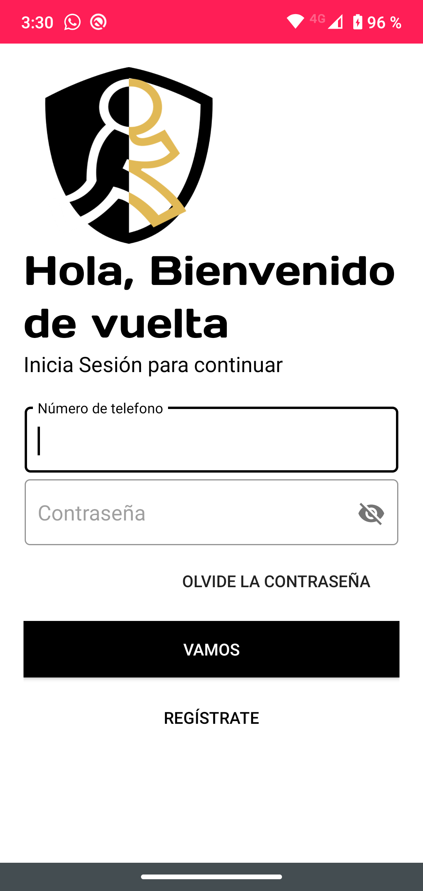
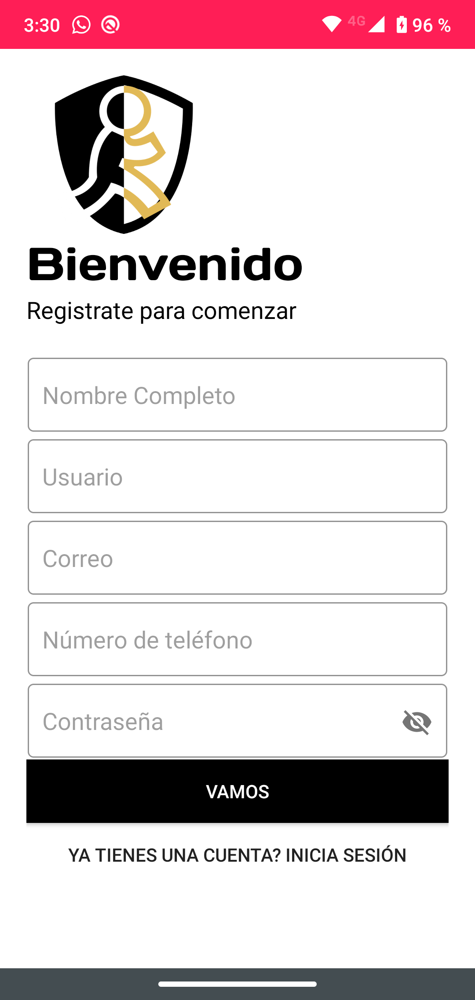
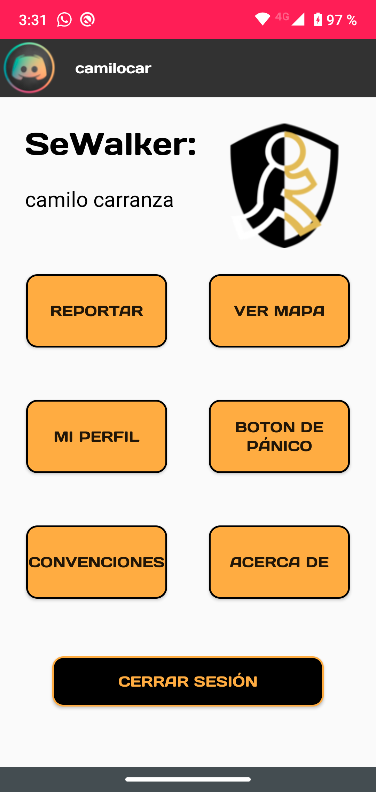
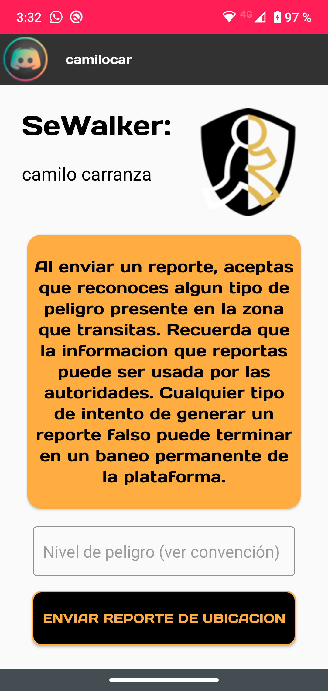
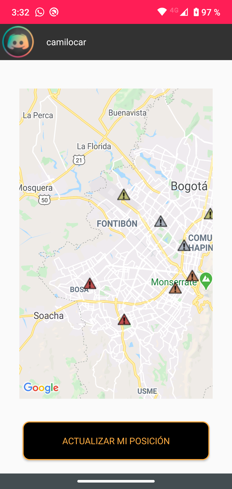
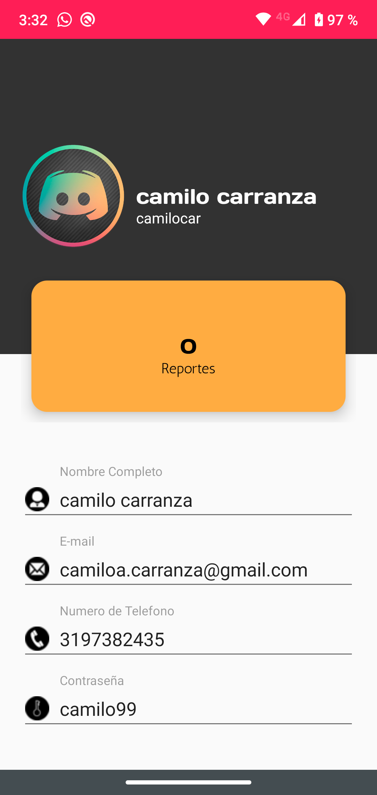
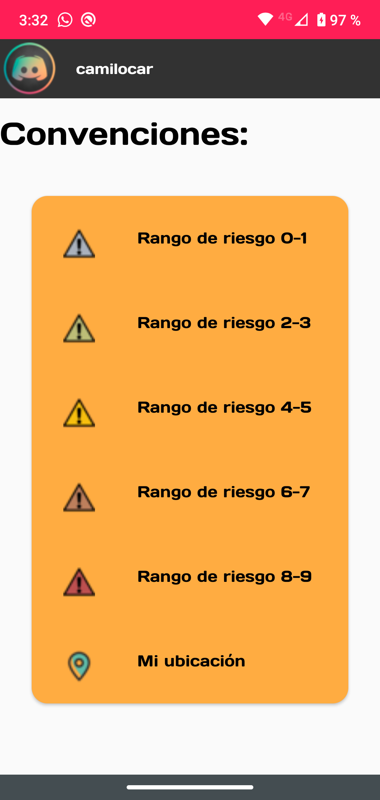
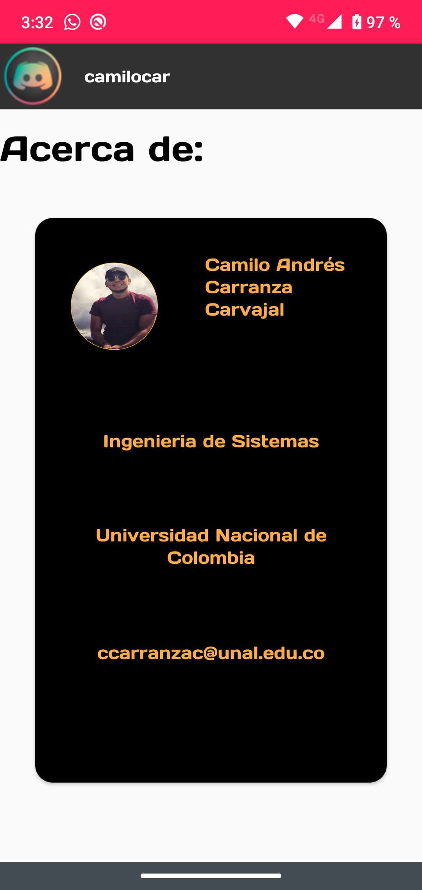

# SeWalk

App Móvil para realizar reportes sobre actividad peligrosa en la ciudad de Bogotá, con el fin de mantener informados a los usuarios de las zonas mas peligrosas de la ciudad

## Interfaz General

  
   
  
  
  
  
  
  
  

